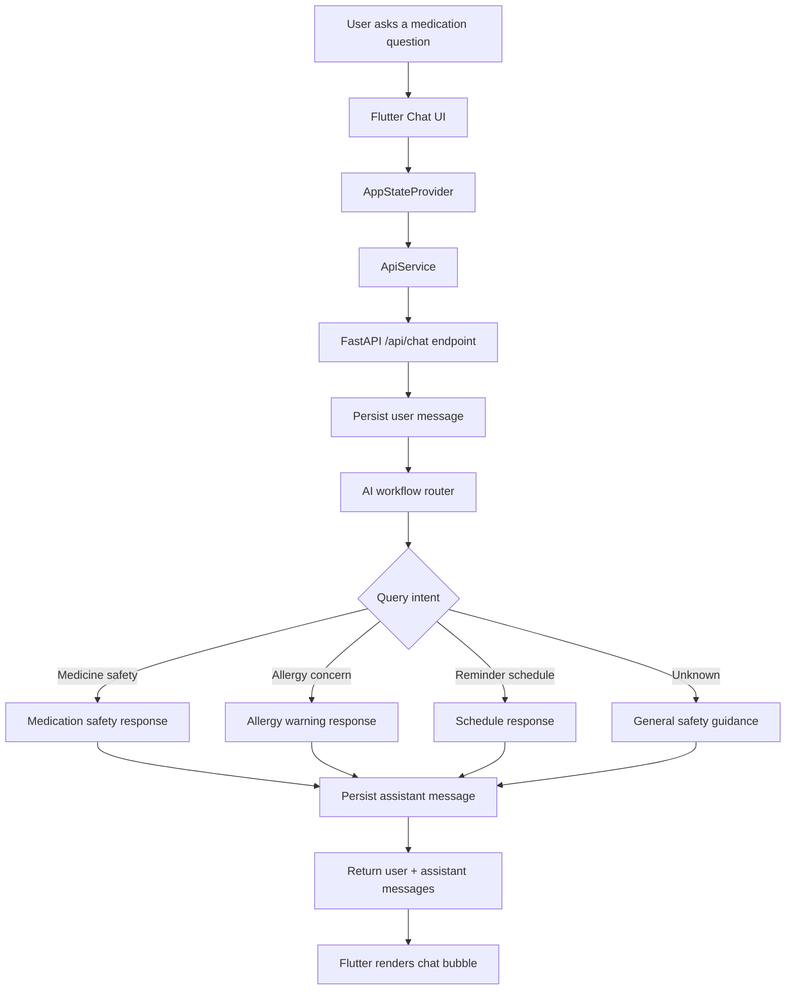
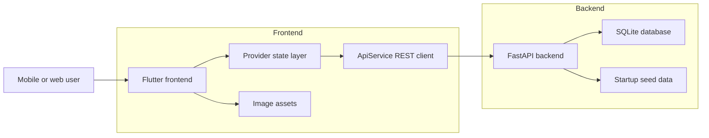

<div align="center">

# MediLens AI

AI-assisted medicine scanning, medication reminders, and safety guidance in a modern Flutter app.

[](https://flutter.dev/)
[](https://fastapi.tiangolo.com/)
[](https://www.sqlite.org/)
[](https://www.docker.com/)
[](LICENSE)

</div>

## Project Overview

MediLens AI is a full-stack healthcare demo that helps users scan medicines, review possible allergy conflicts, manage medication schedules, and ask medication-related questions through a simulated AI pharmacist workflow.

The project is intentionally structured to be recruiter-friendly: it shows mobile-first UI work, state management, REST integration, backend API design, local persistence, environment configuration, Docker packaging, and clean frontend architecture.

## Demo And Screenshots

| Area | Preview |
| --- | --- |
| Demo video | Add Loom, YouTube, or portfolio demo link here |
| Splash and onboarding | `assets/images/splash_screen.png`, `assets/images/onboarding_scan.png` |
| Dashboard | `assets/images/home_dashboard.png` |
| Medicine details | `assets/images/medicine_details.png` |
| AI pharmacist chat | `assets/images/ai_pharmacist_chat.png` |
| Reminders | `assets/images/medication_reminders.png` |
| Medical profile | `assets/images/medical_profile.png` |

## Feature List

- Medicine scanning simulation with allergy conflict detection.
- Medication dashboard with active medicines, adherence progress, and quick actions.
- Reminder creation, completion toggles, and daily schedule state.
- AI pharmacist chat workflow with backend-backed message history and local fallback responses.
- Medical profile view with allergies, vitals, preferences, and settings.
- Offline-first fallback data so the app stays usable when the backend is not running.
- Clean feature-based Flutter architecture with shared models, core services, and app-level state.
- FastAPI backend with seeded data and REST endpoints for users, medicines, reminders, and chat.
- Docker support for frontend and backend local deployment.

## AI Architecture Diagram



## System Architecture



## Tech Stack

| Layer | Technology |
| --- | --- |
| Frontend | Flutter, Dart, Material 3 |
| State management | Provider, ChangeNotifier |
| Networking | `http` package |
| Backend | FastAPI, Uvicorn |
| Data | SQLAlchemy, SQLite |
| Validation | Pydantic |
| Packaging | Docker, Docker Compose |
| Quality | `flutter analyze`, `flutter test`, Dart formatter |

## Folder Structure

```text
MediLens-AI/
├── assets/images/                 # App visuals and screen artwork
├── backend/                       # FastAPI service
│   ├── Dockerfile
│   ├── database.py
│   ├── main.py
│   ├── models.py
│   ├── requirements.txt
│   └── schemas.py
├── lib/
│   ├── app/                       # App composition and global state
│   ├── core/                      # Constants, theme, network layer
│   ├── features/                  # Feature-first presentation modules
│   ├── shared/                    # Shared models
│   └── main.dart                  # Flutter bootstrap
├── test/                          # Widget smoke tests
├── Dockerfile                     # Flutter web container
├── docker-compose.yml             # Frontend + backend local stack
└── .env.example                   # Environment variable template
```

## Installation And Local Setup

### Prerequisites

- Flutter SDK
- Dart SDK
- Python 3.12+
- Docker Desktop, optional

### Frontend

```sh
flutter pub get
flutter run
```

Use a custom backend URL:

```sh
flutter run --dart-define=API_BASE_URL=http://localhost:8000/api
```

### Backend

```sh
cd backend
python -m venv .venv
source .venv/bin/activate
pip install -r requirements.txt
uvicorn main:app --reload
```

The API runs at `http://localhost:8000`.

## Environment Variables

Copy the example file before local development:

```sh
cp .env.example .env
```

| Variable | Used by | Description | Default |
| --- | --- | --- | --- |
| `API_BASE_URL` | Flutter | REST API base URL passed with `--dart-define` | `http://localhost:8000/api` |
| `API_TITLE` | Backend | FastAPI application title | `MediLens AI Backend` |
| `DATABASE_URL` | Backend | SQLAlchemy database URL | `sqlite:///./medilens.db` |
| `CORS_ORIGINS` | Backend | Comma-separated allowed origins | Localhost origins |
| `AI_PROVIDER` | Future AI | AI provider switch for future LLM integration | `mock` |
| `OPENAI_API_KEY` | Future AI | Optional key for a production AI provider | Empty |

## API Documentation

FastAPI exposes interactive docs when the backend is running:

- Swagger UI: `http://localhost:8000/docs`
- ReDoc: `http://localhost:8000/redoc`

| Method | Endpoint | Purpose |
| --- | --- | --- |
| `GET` | `/api/user` | Fetch seeded user profile |
| `GET` | `/api/medicines` | List medicines |
| `POST` | `/api/medicines` | Add medicine |
| `GET` | `/api/reminders` | List reminders |
| `POST` | `/api/reminders` | Add reminder |
| `PATCH` | `/api/reminders/{reminder_id}/toggle` | Toggle reminder completion |
| `GET` | `/api/chat` | Fetch chat history |
| `POST` | `/api/chat` | Send message and receive simulated AI response |

## AI Workflow

1. User submits a message from the chat tab.
2. Flutter stores the user message optimistically for instant feedback.
3. `ApiService` posts the text to `/api/chat`.
4. FastAPI persists the user message.
5. The backend classifies the query using deterministic intent checks.
6. A safety-focused response is generated and persisted.
7. Flutter receives and renders the assistant message.
8. If the backend is unavailable, the app falls back to a local simulated response.

## Docker Support

Run the full stack:

```sh
cp .env.example .env
docker compose up --build
```

Services:

- Frontend web: `http://localhost:8080`
- Backend API: `http://localhost:8000`
- Backend docs: `http://localhost:8000/docs`

Build only the backend:

```sh
docker build -t medilens-api ./backend
docker run --env-file .env -p 8000:8000 medilens-api
```

Build only the Flutter web frontend:

```sh
docker build -t medilens-web --build-arg API_BASE_URL=http://localhost:8000/api .
docker run -p 8080:80 medilens-web
```

## Deployment

### Frontend

- Build Flutter web with the production API URL:

```sh
flutter build web --release --dart-define=API_BASE_URL=https://your-api.example.com/api
```

- Deploy `build/web` to Firebase Hosting, Netlify, Vercel static hosting, S3 + CloudFront, or an Nginx container.

### Backend

- Deploy the FastAPI app to Render, Railway, Fly.io, Docker, ECS, Cloud Run, or any VM that supports Python.
- Set `DATABASE_URL` to a production database when replacing SQLite.
- Set `CORS_ORIGINS` to the deployed frontend domain.
- Keep secrets in the deployment provider secret manager.

## Security And Privacy

- No real patient data should be committed or used in demos.
- `.env` files are ignored by Git; use `.env.example` as the public template.
- CORS origins are configurable instead of hardcoded.
- Current AI responses are deterministic mock guidance, not clinical advice.
- Production builds should add authentication, encryption at rest, audit logs, rate limiting, and stricter medical disclaimers.

## Performance Benchmarks

| Area | Current target | Notes |
| --- | --- | --- |
| Flutter analyze | 0 issues | Verified locally |
| Widget smoke test | Passing | Covers splash-to-onboarding render path |
| Backend startup | Under 2 seconds locally | SQLite seed data loads on startup |
| API latency | Under 100 ms locally | Mock AI workflow avoids external calls |
| Flutter web build size | To be measured in CI | Add release artifact budget before production |

## Testing

Run frontend checks:

```sh
flutter analyze
flutter test
```

Run a basic backend syntax check:

```sh
python -m py_compile backend/*.py
```

Recommended next tests:

- Backend endpoint tests with `pytest` and FastAPI `TestClient`.
- Golden/widget tests for dashboard, reminders, scan, and chat screens.
- Integration test for reminder creation and toggle flow.
- CI pipeline that runs analyzer, tests, Docker builds, and backend checks.

## Roadmap

- Add real OCR or camera package integration for medicine labels.
- Replace deterministic AI responses with an auditable LLM workflow.
- Add authentication and per-user data isolation.
- Add push notifications for medication reminders.
- Add production database support and migrations.
- Add CI/CD workflows.
- Add accessibility and localization passes.
- Add clinical disclaimer and emergency escalation UX.

## Contributing

1. Fork the repository.
2. Create a feature branch: `git checkout -b feature/your-feature`.
3. Install dependencies and run the checks.
4. Keep changes focused and documented.
5. Open a pull request with screenshots for UI changes.

## License

This project is released under the MIT License. See [LICENSE](LICENSE).

## Author And Contact

**Prajwal Mhetre**

- GitHub: [PrajwalMhetre](https://github.com/PrajwalMhetre)
- Repository: [MediLens-AI](https://github.com/PrajwalMhetre/MediLens-AI)
- Portfolio or LinkedIn: Add your preferred profile link here

## Recruiter-Friendly Summary

MediLens AI demonstrates the ability to take a product idea from prototype to a maintainable full-stack application. It highlights frontend architecture, polished mobile UI, backend API design, state management, environment-based configuration, Docker packaging, and practical documentation. The project is scoped as a healthcare assistant demo while keeping privacy and clinical safety boundaries clear.
